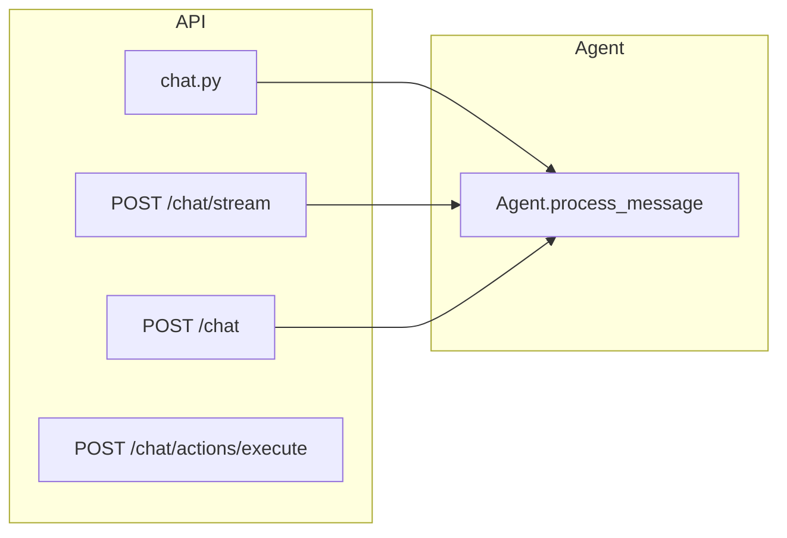
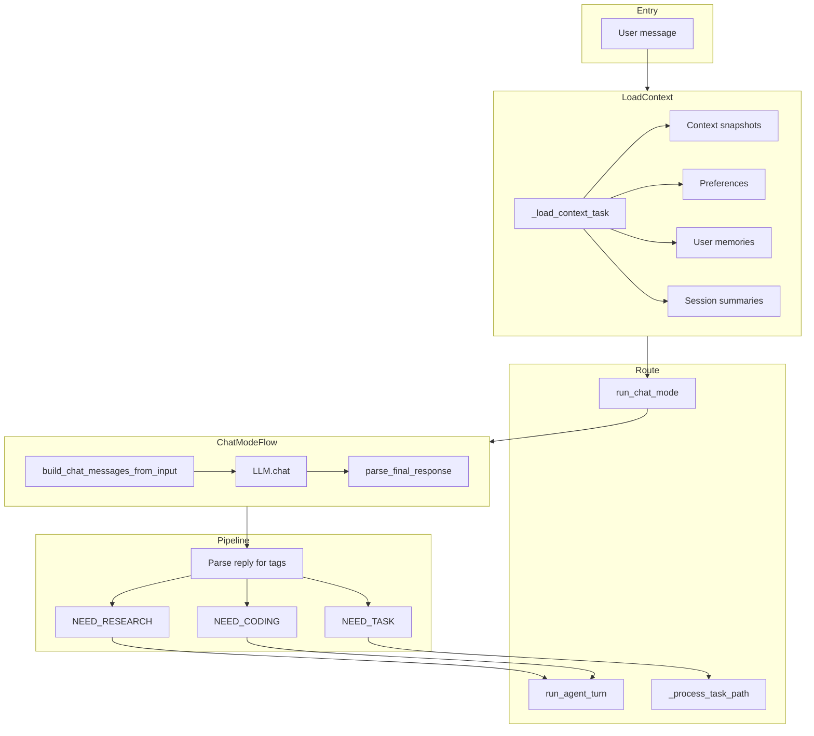
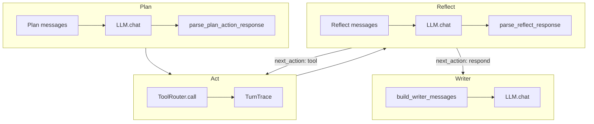
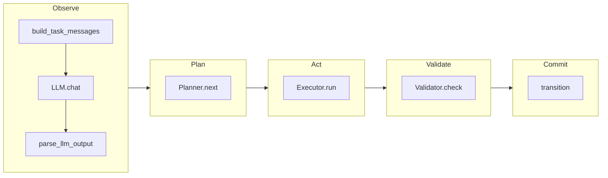
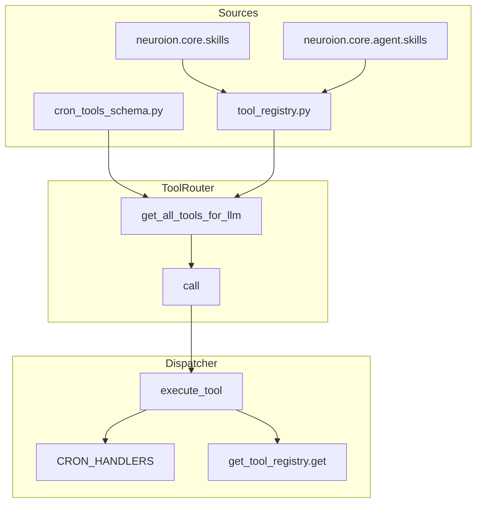

# Agentic Flow

Overzicht van de Neuroion agent: message flow, tool calling, skills, en componenten.

---

## 1. Entry Points

- **chat.py**: `POST /chat` (sync) en `POST /chat/stream` (SSE) → `Agent.process_message`
- **chat.py**: `POST /chat/actions/execute` → `Agent.execute_action` (bevestigde actie uitvoeren)
- Alle requests gebruiken `get_current_user` → `household_id`, `user_id`

---

## 2. Message Flow (Hoofdpad)

**Stappen:**

1. **Load context**: `_load_context_task` (parallel) laadt snapshots, preferences, memories, summaries
2. **Chat mode**: één LLM-call, geen tools; SOUL + context + history
3. **Pipeline tags**: als LLM `[NEED_RESEARCH]`, `[NEED_CODING]` of `[NEED_TASK]` retourneert → switch
4. **Research/Coding**: `run_agent_turn` met tool loop (geen codebase-tools bij research)
5. **Task**: `_process_task_path` (JSON-protocol, planner, executor, validator)

---

## 3. Agentic Turn (run_agent_turn)

**Flow:**

1. **Plan**: LLM krijgt tools + instruction; retourneert JSON met `goal`, `plan_steps`, `tool_calls`, `next_action`
2. **Act**: `ToolRouter.call` voor elke tool_call; resultaten in `TurnTrace`
3. **Reflect** (loop): LLM krijgt observation log; kiest `next_action` (tool | respond | ask_user)
4. **Writer**: als respond → SOUL + facts + user message → finale reply

---

## 4. Task Path (X-Agent-Task-Mode: 1)

- **Observe**: messages + LLM → `kind, payload` (tool_call | need_info | final)
- **Plan**: `Planner.next(state)` → `Action` (via `pending_decision` of task-LLM)
- **Act**: `Executor.run(action)` → `Observation` (ToolRouter bij tool_call)
- **Validate**: `Validator.check` → `ValidationResult`
- **Commit**: `transition(task, ...)`; bij `final` of `tool_call` → done

---

## 5. Tool System

**Tool flow:**

1. **ToolRouter** combineert cron-tools (schema) + registry-tools
2. **call(tool_name, args, context)** → `Dispatcher.execute_tool`
3. **Dispatcher**: eerst `_registry` (cron handlers), anders `get_tool_registry().get(tool_name)`
4. **Registry**: tools van `@register_tool` + auto-loaded skills (`neuroion.core.skills`, `agent.skills`)
5. **kwargs**: `db`, `household_id`, `user_id` worden geïnjecteerd; `path`/`file_path` alias

---

## 6. Skills (geregistreerde tools)

| Package | Module | Tools |
|---------|--------|-------|
| neuroion.core.skills | agenda | agenda.list_events, agenda.add_event, agenda.update_event, agenda.delete_event |
| neuroion.core.skills | codebase | codebase.read_file, codebase.list_directory, codebase.search |
| neuroion.core.skills | web_search | web.search, web.shopping_search, etc. |
| neuroion.core.skills | github_search | github.search |
| tool_registry.py | (inline) | get_current_time, generate_week_menu, get_dashboard_link, etc. |
| tools/cron_handlers | cron | cron.add, cron.update, cron.remove, cron.list, etc. |

Skills worden geladen via `_load_skill_modules()` bij import van `tool_registry`.

---

## 7. Types

| Type | Locatie | Doel |
|------|---------|------|
| AgentInput | types.py | Input: user_message, soul, memory, preferences, history, etc. |
| RunContext | types.py | db, household_id, user_id, allowed_tools |
| RunState | types.py | message, conversation_history, task, pending_decision |
| Action | types.py | tool_call \| need_info \| final \| sub_goal |
| Observation | types.py | Resultaat van Executor.run |
| ToolResult | types.py | success, output, error |
| TurnTrace | agentic.py | Log van tool calls + resultaten |
| ParsedToolCall, ParsedNeedInfo, ParsedFinal | tool_protocol.py | Parse-uitkomst van LLM JSON |

---

## 8. API Endpoints (chat)

| Endpoint | Methode | Beschrijving |
|----------|---------|--------------|
| /chat | POST | Sync chat, retourneert message + actions |
| /chat/stream | POST | SSE stream: status, tool_start, tool_done, done |
| /chat/actions/execute | POST | Voer bevestigde actie uit (action_id) |

---

## 9. Bestandsverwijzingen

| Bestand | Rol |
|---------|-----|
| agent/agent.py | Entry: process_message, execute_action; pipeline routing |
| agent/context_loader.py | load_context_task: snapshots, preferences, summaries, memories |
| agent/gateway.py | run_agent_turn, run_chat_mode, run_reflection_workflow |
| agent/agentic.py | TurnTrace, parse_plan_action_response, parse_reflect_response |
| agent/agent_loop.py | run_one_turn (Plan → Act → Validate) |
| agent/planner.py | Planner.next, create_plan |
| agent/executor.py | Executor.run |
| agent/tool_router.py | ToolRouter.call, get_all_tools_for_llm |
| agent/tool_registry.py | ToolRegistry, @register_tool, _load_skill_modules |
| agent/tool_formatters.py | tools_list_text_for_agent, result_summary_for_trace |
| agent/tools/dispatcher.py | execute_tool, CRON_HANDLERS |
| agent/tool_protocol.py | parse_llm_output, format_tool_result_for_llm |
| agent/prompts.py | build_chat_messages_from_input, get_soul_prompt, etc. |
| api/chat.py | Chat router, stream/sync endpoints |
